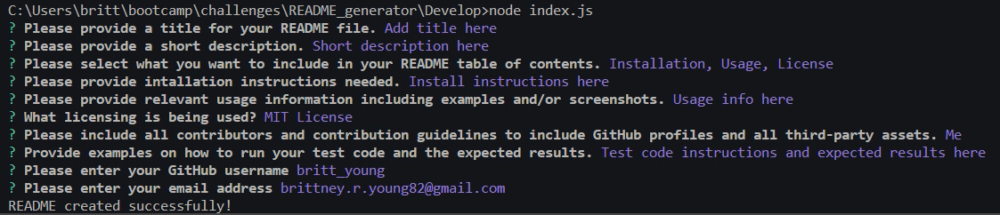

# Professional README Generator

## Description
- As a developer, I wanted to create a README generator that would allow me to quickly build a high-quality README file from the command line interface
SO THAT I can quickly create a professional README for a new project

## Installation
User must install the 'inquirer' package by typing "npm i inquirer@8.2.4" into the CLI

## Usage
* Download/ clone the provided GitHub repository code
* Open the index.js file in your preferred text editor
* Open the integrated terminal while within the index.js file
* Run the command "node index.js" to initiate the program, respond to the prompts, and generate your README file

    
   

## Credits
Utilized third-party sources such as Bootcamp Teaching Assistants, Stack Overflow, and GitHub at [https://coding-boot-camp.github.io/full-stack/github/](https://coding-boot-camp.github.io/full-stack/github/)

## License
n/a

## Tests
No test specified
